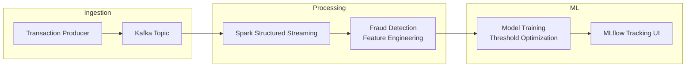

# 🚀 Real-Time Fraud Detection Pipeline (Kafka + Spark + MLflow)

This project implements a complete **real-time fraud detection pipeline**, combining streaming ingestion, distributed processing, and machine learning experimentation.

It simulates financial transactions, detects suspicious behavior in real time, and tracks model performance using MLflow.

---

## 🧠 Tech Stack

- **Apache Kafka** → real-time transaction ingestion  
- **Apache Spark Structured Streaming** → distributed stream processing  
- **PySpark** → fraud detection transformations  
- **Scikit-Learn** → fraud classification models  
- **MLflow** → experiment tracking + model registry  
- **Docker Compose** → full reproducible environment  

---

## 📌 Pipeline Architecture




---

## ⚙️ How to Run the Project

### 1. Start the environment

```bash
docker compose up -d
```

### 2. Run Kafka Producer

```bash
python producer/producer.py
```
This will continuously generate transaction events.

### 3. Run Spark Streaming Job

```bash
docker exec -it sparkmaster \
  /opt/spark/bin/spark-submit \
  --master spark://sparkmaster:7077 \
  --packages org.apache.spark:spark-sql-kafka-0-10_2.12:3.5.0 \
  /app/stream.py
  ```

### 4. Train Fraud Detection Model  
```bash
python mlflow/train.py
```

### 5. View Experiments in MLflow

Access MLflow UI:

```👉 http://localhost:5000```

## 📊 Results

Feature Engineering improved accuracy from ~0.53 → 0.69

ROC-AUC reached 0.77

Threshold optimization achieved:

**✅ Fraud Recall:** 96%

**⚠️ Precision:** 49% (aggressive fraud-catching mode)

## 🔥 Key Learning

- This project demonstrates real-world ML engineering practices:
- Streaming ingestion + processing
- Fraud detection rules + feature engineering
- Experiment tracking with MLflow
- Threshold tuning using Precision–Recall curves
- Production mindset trade-offs (Recall vs Precision)

## 🚀 Next Steps

- Deploy model with MLflow Serving
- Apply trained model directly inside Spark streaming
- Expand fraud patterns beyond simple thresholds

## 👤 Author
*Paloma Cordeiro*
